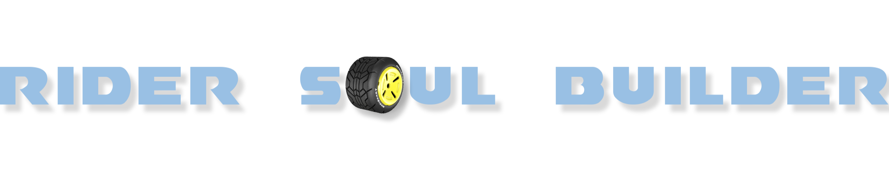
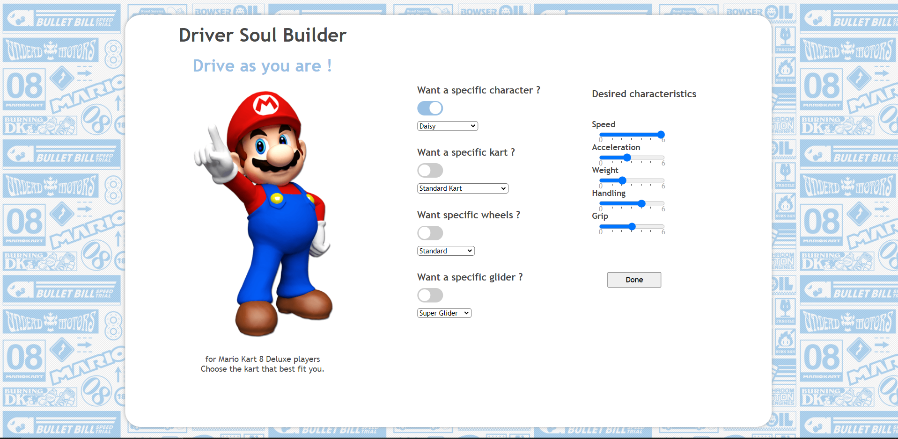
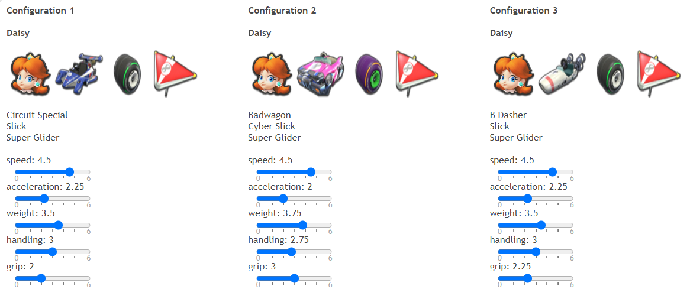
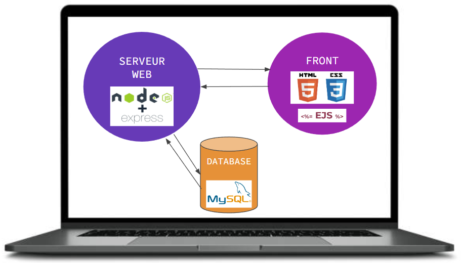
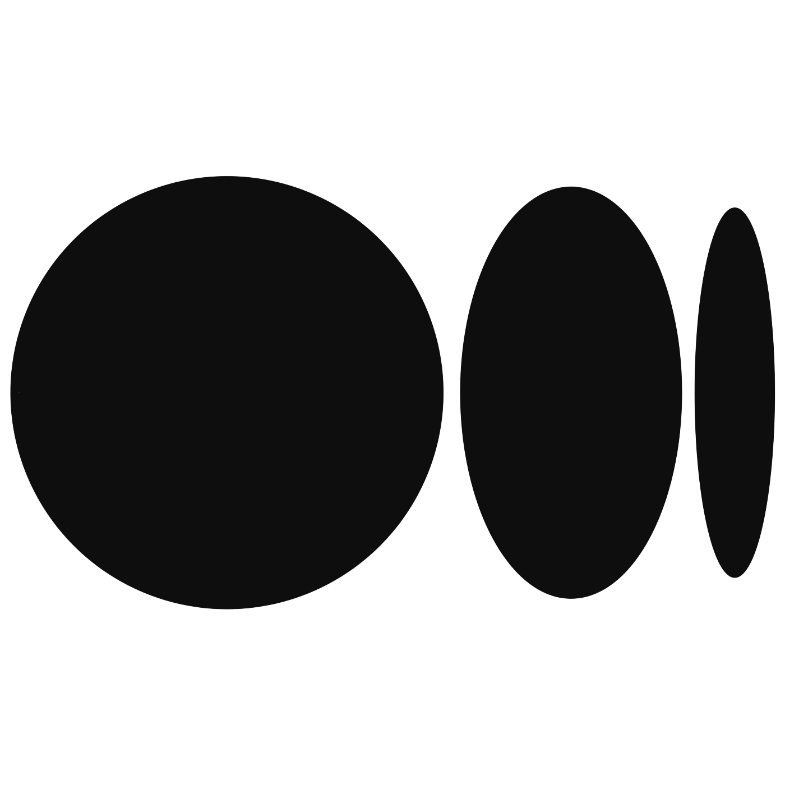

<h1>Introduction</h1>
Rider Soul Builder is a web application, for Mario Kart 8 Deluxe players, that allows players to choose between the three best kart configurations by entering the desired characteristics in terms of speed, acceleration, weight, handling and grip.

The aim of this project is to spend more time playing and less choosing kart configuration.

<h1>Story of the project</h1>

This idea came to me while playing Mario Kart 8 Deluxe. I use to play at school, with my peers, after lunch. But, not being a regular player of Mario Kart, I never knew which character to choose and which kart configuration best suits my expectations.

There is more than 500 000 possible configurations in that game so, I spend a lot of time before playing. My peers began to feel that time goes slowly and they were tired of waiting for me and I probably gone to loose their sympathy. Thinking that there were probably a lot of people in the same situation, I’ve decided to create this web application.

<h1>How it work ?</h1>

The player can choose a specific character, or even specific wheel, kart and glider, then he choose the desired characteristics like speed, acceleration, weight, handling and grip.

The web application returns the three best kart configurations that best suits player expectations.

<h1>Architecture and used technologies</h1>

I chose to use HTML and CSS for the front-end and EJS as a template, which allows you to inject JavaScript code into the HTML. That is useful when you want to display several data in a drop-down list, for the name of the characters for example.

Once the player has chosen the desired characteristics (speed, acceleration, …), he will send a request to the web server which is managed by NodeJS and its Express module which simplifies requests.

Then, the web server will query the MySQL database to retrieve the possible configurations.

Then, thanks to the code base in JavaScript, the possible configurations are compared with those wanted by the player and it returns the three best ones and the player is happy. But keep in mind that win a race is also due to natural rider skills.

<h1>To be continued</h1>

In the future, I will improve the code base in order to compare more precisely the different configurations, by integrating all the characteristics.

The possible configurations are represented by vectors on a virtual graph and I will estimate the distance with the concept of priority for the characteristics.

I also plan to let the player choosing between a kart or a motorcycle.

<h1>Author</h1>

Marion Baussart - I’m 28, student at Holberton School Lille and a future computer scientist.

 

# Related projects

* [AirBnB Clone](https://github.com/MarionBaussart/AirBnB_clone_v2)
* [Simple Shell](https://github.com/MarionBaussart/simple_shell)